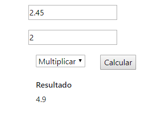

# Desafío Bunkey!

Web App que realiza cálculos de 2 números con los 4 básicos operadores: suma, resta, división y multiplicación.

Para ingresar a la web app directamente hacer [click aquí][https://mpabarca.github.io/postulacionBunkey/]

## Instrucciones de Uso

Ingresar dos números (entero o decimal) en los recuadros como aparece en la imagen adjunta, escoger el tipo de operación y apretar botón calcular. El resultado aparecerá bajo el título de Resultado. 

